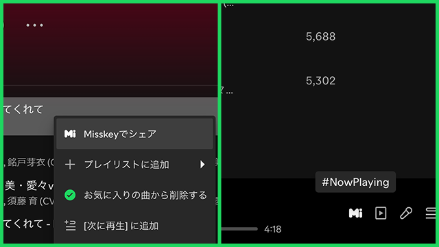

# Share on Misskey
Misskeyへ共有するボタンを追加するSpicetify拡張機能です。



## 機能
- コンテキストメニューに「**Misskeyでシェア**」を追加\
[共有されるテキスト](#共有されるテキスト)
- コントロールパネルに「**#NowPlaying**」を追加\
[共有されるテキスト](#共有されるテキスト) + `#NowPlaying`

### 共有されるテキスト
#### 曲
```
<曲名> - <アーティスト名>
https://open.spotify.com/track/<id>
```

#### ポッドキャスト（エピソード）
```
<エピソード名> - <番組名>
https://open.spotify.com/episode/<id>
```

#### アルバム / アーティスト / ポッドキャスト（番組） / プレイリスト
```
<タイトル>
https://open.spotify.com/<album|artist|show|playlist>/<id>
```

## インストール
### Marketplace
1. **Marketplace > 拡張機能**で「**Share on Misskey**」を検索
2. インストールボタンをクリックして、リロード
3. [初期設定](#初期設定)をする

### 手動
1. [最新のリリース](https://github.com/Midra429/spicetify-share-on-misskey/releases/latest)から`share-on-misskey.js`をダウンロード
2. コマンドを実行して、Spicetifyのコンフィグフォルダを開く
```sh
spicetify config-dir
```
3. `share-on-misskey.js`を`Extensions`内に置く
4. Spotifyを完全に閉じて、コマンドを実行
```sh
spicetify config extensions share-on-misskey.js
spicetify apply
```
5. [初期設定](#初期設定)をする

## アップデート
### Marketplace
自動でアップデートされます。

### 手動
1. [インストール（手動）](#手動)の1〜3
3. Spotifyを完全に閉じて、コマンドを実行
```sh
spicetify apply
```

## アンインストール
### Marketplace
1. **Marketplace > インストール済み**から「**Share on Misskey**」を削除
2. [Misskeyのアクセストークンを削除](#Misskeyのアクセストークンを削除する)

### 手動
1. [インストール（手動）](#手動)の3で置いたファイルを削除
2. Spotifyを完全に閉じて、コマンドを実行
```sh
spicetify config extensions share-on-misskey.js-
spicetify apply
```
3. [Misskeyのアクセストークンを削除](#Misskeyのアクセストークンを削除する)

## 初期設定
Spotifyの**設定 > Share on Misskey**から設定できます。

| 設定項目 | 説明 |
| - | - |
| **サーバーのホスト** | 共有先のMisskeyサーバーのホストを入力 |
| **アクセストークン** | Misskeyのアクセストークンを入力 |
| **Misskey Webで投稿する**<br>(アクセストークン不要) | Misskey Webの投稿画面を開くようにする |
| **公開範囲** | Misskeyの公開範囲 |

### Misskeyのアクセストークンを取得する
1. Misskeyの[**設定 > API**](https://misskey-hub.net/ja/mi-web/?path=/settings/api)を開く
2. 「**アクセストークンの発行**」をクリック
3. 「**名前**」に「**Spicetify Share on Misskey**」を入力
4. 「**権限**」の「**ノートを作成・削除する**」をONにする
5. 右上のチェックボタンを押す
6. 表示された「**確認コード**（アクセストークン）」をコピーする
7. 閉じる

### Misskeyのアクセストークンを削除する
1. Misskeyの[**設定 > API > アクセストークンの管理**](https://misskey-hub.net/ja/mi-web/?path=/settings/apps)を開く
2. 「**Spicetify Share on Misskey**」を削除

## Made with Spicetify Creator
https://github.com/spicetify/spicetify-creator
